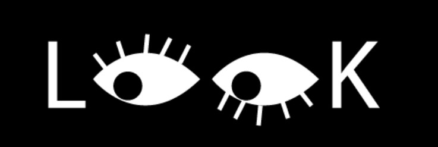
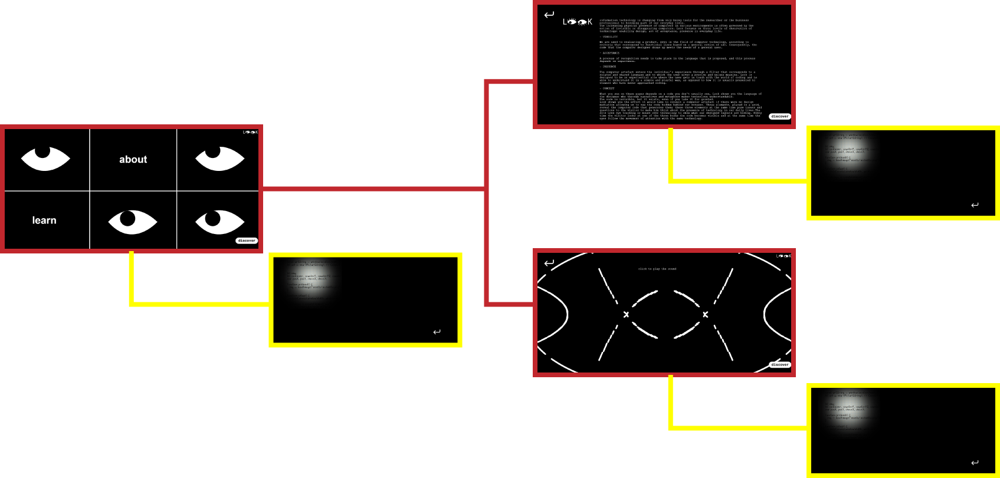

# P5-empty-project

This repository is the starting point of the assignments given in the elective course [Creative Coding at Politecnico di Milano](https://www11.ceda.polimi.it/schedaincarico/schedaincarico/controller/scheda_pubblica/SchedaPublic.do?&evn_default=evento&c_classe=696598&__pj0=0&__pj1=3ed8420c42c849845b5caa3de626e8fc).
Browse [this website](https://drawwithcode.github.io/) if you want to know more about it.



# PROJECT IDEA

**THEME/CONCEPT**

The project stems from an argument contained in Hallnäs and Redström's article "From Use to Presence: On the Expressions and Aesthetics of Everyday Computational Things". The paper analyses how information technology has changed its role within our lives.
Look investigates the role of design in the design of everyday computer artefacts by focusing on between levels of observation of technology: the design of usability, the act of acceptance that the user undergoes when choosing to use an artefact, and finally the presence of the artefact in everyday life.

**AIM**

The aim of Look is to make visible what is often taken for granted: the code.
The code that the computer designer develops depends, in fact, on the needs of a general user, the cultural background and previous skills of the user sample. Look shows you the language of the designer, who through narratives and metaphors makes technology comprehensible.
Making code visible also means showing the effort that would be required to consult a computer artefact if there were no design mediation. Would we agree to consult the hundreds of pages on the Internet if they were written in code?
Code is invisible, but it exists, Look wants to remember it.

**CONTEXT OF USE**

The project becomes part of an exhibition that has as its content the theme of reflection. Constitutes its concluding site and can also be consulted remotely by users interested in the subject. It can potentially be a site applicable to any computer element, a bridge between the (invisible) code and what we are used to seeing as users.

# STRUCTURE

The project consists of six HTML pages: three main pages coupled with three pages representing the 'translation' in code of the visible screen, the so-called 'discover' pages.



**index.html** – is the opening page of Look. Four eyes, a metaphor for 'looking beyond our designed screens', follow the user's gaze. The code of this page can be discovered by pressing the 'discover' button, bottom left. Using the 'about' and 'learn' buttons, however, it is possible to continue the experience on the other html pages.
**about.html** – is the page that tells the concept of the project and informs the user of the thinking behind Look. Again in the bottom right-hand corner is the 'discover' button, which allows the user to discover the code hidden even behind simple text. At the top left, on the other hand, an arrow allows the user to return to the main page.
**learn.html** – is at the heart of Look. Generative art, created through code on javascript, presents itself to the user with visual and sound elements. At the bottom right, it is always possible to discover the code via 'discover', while at the top left, it is possible to return to the main Look page.

# CODE

**Eye movement code**
The movement of the eyes, in addition to being defined by eye tracking technology, is influenced by the movement of the cursor on the screen. The position of the cursor on the screen is defined by the coordinates posX and poY, defined within the function posicionar(), and is used to define the coordinates of the pupils.

sketch.js

```JavaScript
//this function maps the position of the eye to the position of the mouse
function posicionar() {
  posX = map(mouseX, 0, width, width / 2 - 60, width / 2 + 60);
  posY = map(mouseY, 0, height, height / 2 - 60, height / 2 + 60);
}
```

```JavaScript
//call function that define the position of the eyes
  posicionar();

  //first eye
  image(img, width / 6, height / 4, 300, 150);
  fill(0);
  circle(posX - 500, posY - 200, 90);
  //second eye
  image(img, (width * 3) / 6, (height * 3) / 4, 300, 150);
  fill(0);
  circle(posX, posY + 200, 90);
  //third eye
  image(img, (width * 5) / 6, height / 4, 300, 150);
  fill(0);
  circle(posX + 500, posY - 200, 90);
  //fourth eye
  image(img, (width * 5) / 6, (height * 3) / 4, 300, 150);
  fill(0);
  circle(posX + 500, posY + 200, 90);
```

**Code for Generative Art**
The 'learn' page is created using generative art based on cycles that define the movement of lines according to initially defined parameters.

sketch3.js

```JavaScript
//variables relative to the generative art
const num = 720;
//The Float32Array typed array represents an array of 32-bit floating point numbers
const x = new Float32Array(num);
const y = new Float32Array(num);
const vx = new Float32Array(num);
const vy = new Float32Array(num);
const maxDistSq = 20 ** 2;
const minDistSq = 16 ** 2;

function draw() {
  //define background color
  background("black");

  //define stroke and strokeWeight of the lines
  stroke("white");
  strokeWeight(9);

  //cycles that define the movment of the lines
  for (let i = num; i--; ) {
    for (let j = i; j--; ) {
      d = (x[i] - x[j]) ** 2 + (y[i] - y[j]) ** 2;
      if (minDistSq < d && d < maxDistSq) line(x[i], y[i], x[j], y[j]);
    }
  }
  for (let i = num; i--; ) {
    x[i] += vx[i];
    y[i] += vy[i];
    if (x[i] < 0 || x[i] > width) vx[i] *= -3;
    if (y[i] < 0 || y[i] > height) vy[i] *= -8;
  }
}
```

**Code for setting text and style (CSS sheet)**
The 'about' page contains the text that tells about the project, the entire text is contained in the html file and its features are called up by the style sheet (css).

about.html

```HTML Entities
<!-- insert text inside div, and call the features from the style sheet   -->
    <div id="didascalia">
      <p>
        Information technology is changing from only being tools for the
        researcher or the business professional to becoming part of our everyday
        lives.
        <br />The increasing physical presence of computers in various
        environments is often governed by the notion of invisible or
        disappearing computers. Look focuses on three levels of observation of
        technology: usability design, act of acceptance, presence in everyday
        life.
      </p>
```

style.css

```CSS Entities
#didascalia {
  position: absolute;
  padding-top: 80px;
  padding-left: 25%;
  padding-right: 12%;
  color: rgb(255, 255, 255);
  font-family: "Courier New", Courier, monospace;
  line-height: 1;
  text-align: left;
}
```

**Code for mask creation and application (torch)**
The 'discover' pages contain the mask element, which is defined in a separate javascript file. The discover.js files contain the code for applying this mask to the page content.

mask1.js

```JavaScript
var r;

function createBlurMask(width, height, r) {
  const g = createGraphics(width, height);
  // g.noStroke();
  g.background(0);

  g.drawingContext.filter = `blur(${r + 100}px)`;

  g.drawingContext.ellipse(
    width / 2,
    height / 2,
    width / 4,
    height / 4,
    0,
    0,
    TWO_PI
  );
  g.drawingContext.fill();

  return { graphics: g, width: width, height: height, background: 0 };
}

function applyMask(mask, x, y) {
  push();
  blendMode(MULTIPLY);

  image(mask.graphics, x, y);

  fill(mask.background);
  noStroke();

  // Draw the right, left, top, bottom rectangles to mask the entire screen
  const r = x + mask.width,
    l = x,
    t = y,
    b = t + mask.height;
  rect(0, 0, width, y); // top
  rect(0, b, width, height - b); // bottom
  rect(0, t, x, b - t); // left
  rect(r, t, width - r, b - t); // right

  pop();
}
```

discover1.js - discover2.js - discover3.js

```JavaScript
let mask;

function setup() {
  mask = createBlurMask(500, 500, 30, 25);

}

function draw() {
  applyMask(mask, mouseX - mask.width / 2, mouseY - mask.height / 2);
}

```

**Webgazer library and eye tracking start-up**
Webgazer.js has been implemented for eye detection and recognition. In our case, we used the movement of the eyes to move them on the main page. All the code containing the instructions to load the library and detect the movement is contained in the eyetracking.js file.

eyetracking.js

```JavaScript
webgazer
  .setGazeListener(function (data, elapsedTime) {
    if (data == null) {
      return;
    }
    var xprediction = data.x; //these x coordinates are relative to the viewport
    var yprediction = data.y; //these y coordinates are relative to the viewport
    console.log(elapsedTime); //elapsed time is based on time since begin was called
  })
  .begin();
```

# CHALLENGES

The main challenge we faced was the implementation of the webgazer library. The main problem was to understand how the calibration works, we concluded (also by documenting ourselves) that the first click of the cursor is significant for the calibration of the webgazer technology, which somehow derives information from the movement of the cursor that has a prediction function.
Another issue was to find a way to make the theme of the project evident and interesting. How to 'make visible' the code? The mask (torch) trick seemed good to us to amplify the meaning.

# TEAM

## **Sofia Cadisco**

## **Giuliana Concialini**

## **Bianca Oriani**

## **Benedetta Ricciardi**

# COURSE

Creative Coding 2022/2023

## **Politecnico di Milano** – Scuola del Design

## **Faculty**: Michele Mauri, Andrea Benedetti, Tommaso Elli.
